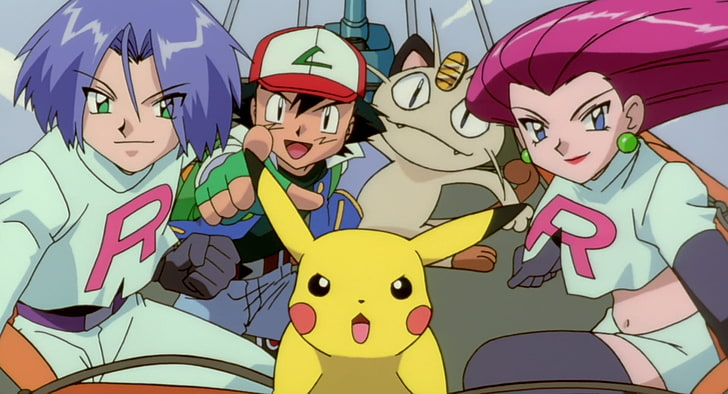
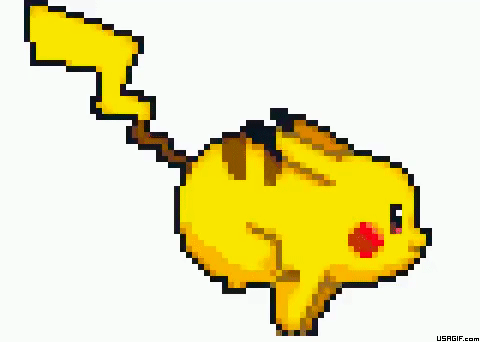

# OOP BROWSER GAME

# DESCRIPTION
- This game was the first project i did in my Full stack Web Dev course, in Ironhack.
- The game consists on randomly generated images of characters, that the user needs to click to win points. If the user clicks on the wrong images it loses points.
- Its like a "Break your own record game" , give it a try !

# INSTRUCTIONS TO PLAY
- Open game page, read the instructions and click on "Start Game".
- You're part of the very best Team Rocket and u need to help catch Pikachu.
- U just need to click on it. It's the yellow guy with a cool hat.
- Be careful because many will try to stop u, and if u click on them u will lose points.
- If u reach 0, u will lose. But no worries, u can try again !
- The best duo, Jesse and James, will appear to help and GAIN EXTRA POINTS.
- Also the Trainer of Pikachu, Ash, will appear to stop u. Take care, he will make u LOSE EXTRA POINTS.

# GAME
[Play Game](https://hugocastroferro.github.io/javascript-catch-the-pikachu-game/)
 